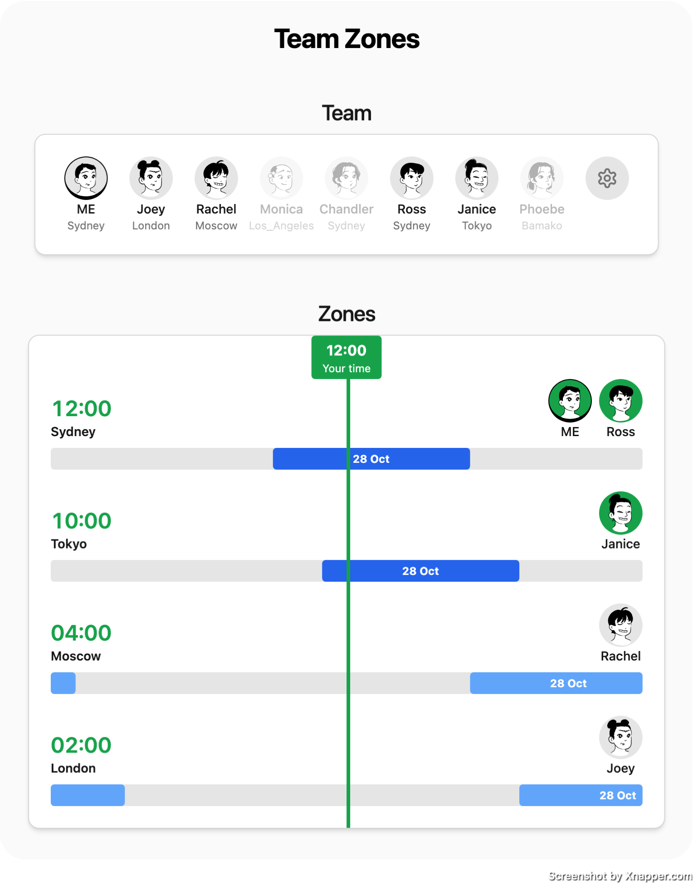

# Team Zones

Team Zones is a free tool designed to simplify scheduling and enhance coordination for remote teams across different time zones. It's a perfect solution for global teams looking to improve their productivity and communication efficiency. The live application can be accessed at [Team Zones](https://team-zone.vercel.app/).

## Technologies Used

- Next.js: A popular React framework for building web applications.
- Tailwind CSS: A utility-first CSS framework for rapidly building custom user interfaces.
- Zod: A TypeScript-first schema declaration and validation library.
- Luxon: A powerful library for working with dates and times in JavaScript.
- useUrl: My custom Next.js hook that replaces `useState` and stores the state in the URL. It also validates the data. This hook is used for storing React state in the URL for persistence and sharing.

## Approach Taken

The application was built using a component-based approach, leveraging the power of React and Next.js. The UI state is stored in the URL, allowing users to share a link to a specific timezone view without signing up or logging in. This is achieved using my custom `useUrl` hook, which replaces `useState` and stores the state in the URL. It also validates the data using Zod.

## Running Tests

The application uses Jest and Testing Library for testing. To run the tests, follow these steps:

1. Clone the repository to your local machine.
2. Navigate to the project directory.
3. Run `npm install` to install the dependencies.
4. Run `npm run test` to execute the tests.

## Unsolved Problems

Currently, there are no unsolved problems in the project. However, future enhancements could include the ability to persist team member data using a backend database and user authentication for personalized team management.
